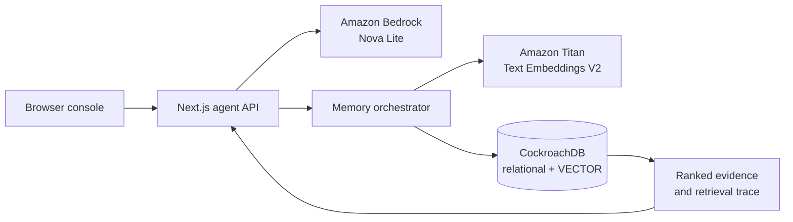

# ClientOps Memory AI

> An AI operations agent that remembers every client decision, instruction, task, preference, and workflow—and uses that memory to make future actions smarter.

ClientOps Memory AI is a persistent organizational-memory console for agencies and service businesses, built for the CockroachDB × AWS Agentic Memory Hackathon. It turns operational conversations into typed, evidence-backed memory rather than an opaque chat transcript.

## Why persistent memory matters

Client work fragments across meetings, notes, handoffs, tasks, and approvals. Chat history can repeat text, but it cannot reliably answer: *What is current? What was superseded? Who committed to what? What evidence supports this answer?* ClientOps models those questions directly.

## Judge demo

1. Load the synthetic **Magnum Roofing Demo** workspace.
2. Enter: “For new Angi leads, assign them to Israel and add Matt as follower. If unanswered, send a voicemail and follow up tomorrow.”
3. Start a new session and ask: “What did we decide about new roofing leads?”
4. Ask: “Use the same process for a new campaign, but don’t add Matt.”
5. Ask: “Why isn’t Matt being added anymore?” and open **View memory evidence**.
6. Inspect the explorer, vector retrieval trace, decision history, and architecture view.

## Architecture



## Memory model

- **Episodic:** events, conversations, workflow changes, and completed actions.
- **Semantic:** stable facts, preferences, assignments, and standing instructions.
- **Decision:** approval, rationale, provenance, and explicit superseding links.
- **Commitment:** owner, due date, task state, dependency, and completion evidence.

Conflicts are surfaced instead of silently merged. Historical decisions remain queryable after being superseded. Confidence, source, timestamp, type, status, and answer relationship appear in the evidence drawer.

## CockroachDB

CockroachDB is the system of record, not a logging sidecar. The `clientops_memory` database contains 11 tables for workspaces, users, clients, conversations, messages, memories, embeddings, decisions, tasks, links, agent runs, and retrieval events (the latter two are operational trace tables). `VECTOR(1024)` stores Titan embeddings; `CREATE VECTOR INDEX` enables distributed approximate search; cosine distance (`<=>`) ranks paraphrased queries. The live cluster migration and a real paraphrased vector query are documented in [docs/cockroachdb-implementation.md](docs/cockroachdb-implementation.md).

CockroachDB Managed MCP is an optional administrative surface for schema inspection and diagnostics. No database credentials are committed or exposed.

## AWS and Bedrock

Amazon Bedrock powers reasoning with `amazon.nova-lite-v1:0` and embeddings with `amazon.titan-embed-text-v2:0` in `ap-south-1`. The AWS SDK uses the standard credential chain. A live Nova Lite inference and a 1,024-dimensional Titan embedding were verified through the authenticated AWS environment. The app never hardcodes AWS keys.

## Responsible AI

Answers separate stored facts from AI inference, cite source memory, and show confidence and timestamps. Users can edit, delete, mark inaccurate, complete tasks, and supersede decisions. Deleted or inaccurate memories are excluded from retrieval. Failure modes return honest diagnostics; the app never silently fakes a live Bedrock response.

## Evaluation

`npm run eval` executes ten long-term-memory scenarios: exact recall, paraphrased recall, multi-memory synthesis, contradiction, superseding, task commitment, preference recall, irrelevant rejection, new-session persistence, and deleted-memory exclusion. Current deterministic harness result: **10/10 scenarios passing**. Live infrastructure results are recorded separately and are not substituted with mocked scores.

## Local setup

```bash
npm install
cp .env.example .env.local
npm run db:migrate
npm run dev
```

Environment variables:

| Variable | Purpose |
|---|---|
| `DATABASE_URL` | CockroachDB connection string; never commit it |
| `AWS_REGION` | Bedrock region, default `ap-south-1` |
| `BEDROCK_MODEL_ID` | Reasoning model |
| `BEDROCK_EMBEDDING_MODEL_ID` | Embedding model |

AWS authentication uses IAM Identity Center, an attached runtime role, or another temporary credential-chain source. Do not create permanent root keys.

## Testing

```bash
npm test
npm run lint
npm run build
npm audit
```

## Deployment

Build with `npm run build` and deploy the Next.js server to an AWS service with temporary-role access to Bedrock and the four environment variables above. See [docs/deployment.md](docs/deployment.md).

## Known limitations

- The browser-only demo persists synthetic memory in local storage so the complete judging flow remains explorable before cloud credentials are attached; the UI and `/api/health` disclose demo/degraded mode.
- Managed MCP setup depends on CockroachDB Cloud authorization and is not required by the indexed hackathon rules.
- The live vector smoke test currently contains one embedded demo memory; production seeding should embed every record.

## Hackathon disclosure

This is a new project created for the CockroachDB × AWS Agentic Memory Hackathon. Synthetic demo data only. AI-assisted development was used. No code or data from prior hackathon projects was reused.

## License

[MIT](LICENSE)
